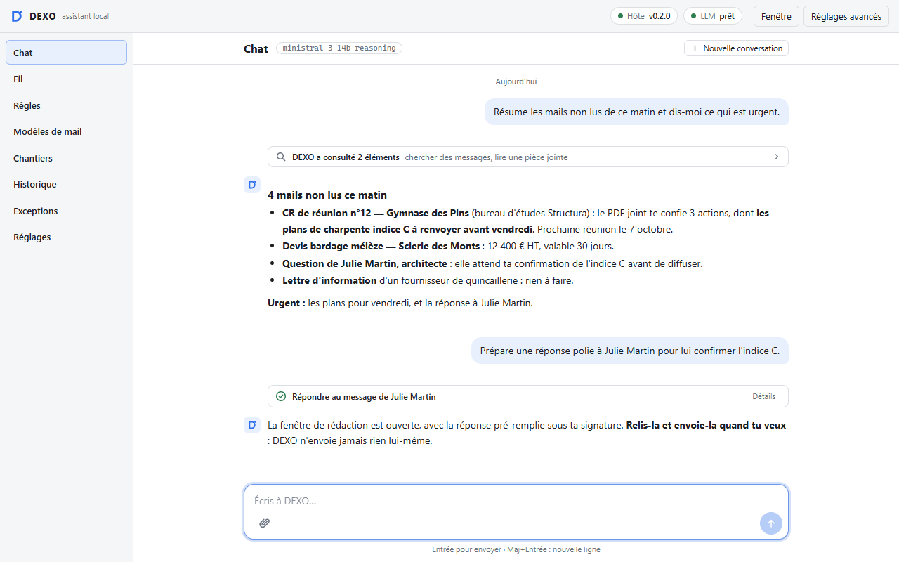
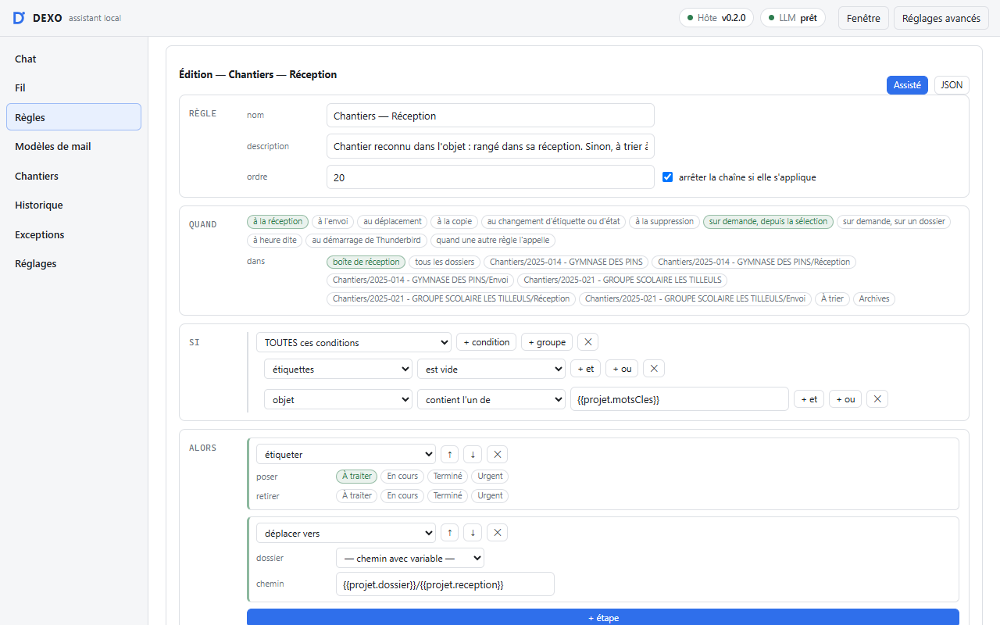
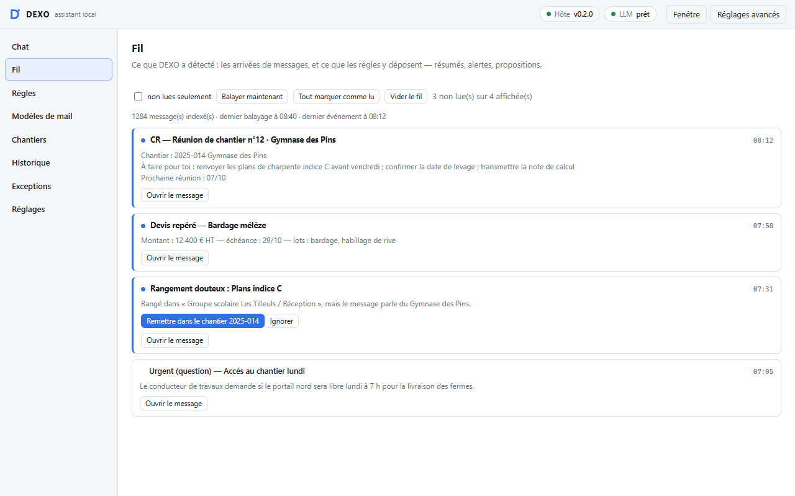

# DEXO

**Un assistant de messagerie pour Thunderbird qui travaille entièrement sur ton poste.**
Il lit, trie et prépare tes mails avec un modèle d'intelligence artificielle local
(LM Studio) : aucun message ne quitte ta machine.

Pensé pour le bureau d'études d'une entreprise du bâtiment — chantiers, comptes rendus,
plans —, utile à quiconque reçoit beaucoup de courrier.



*Demande en français, DEXO s'occupe du reste : il résume tes mails non lus, lit les PDF joints,
repère l'urgent et prépare ta réponse. Tu relis, tu envoies. Tout reste sur ton ordinateur.*

| Les règles | Le fil |
|---|---|
|  |  |
| Une seule règle pour tous tes chantiers : chaque mail rejoint le bon dossier, reconnu à son numéro ou à son nom. Tu la simules avant de l'activer, et tu annules d'un clic. | L'essentiel sans ouvrir chaque mail : actions tirées des comptes rendus, devis repérés avec leur montant, rangements douteux corrigés d'un clic. |

## Ce que fait DEXO

- **Un chat dans Thunderbird.** « Résume les mails non lus d'aujourd'hui », « range ce mail
  dans le dossier du chantier », « prépare une réponse polie » : DEXO agit, et pour écrire, il
  ouvre la fenêtre de rédaction. C'est toujours toi qui relis et qui envoies.
- **Des règles de tri** plus fines que les filtres de Thunderbird : conditions sur l'objet,
  l'expéditeur ou les pièces jointes, bibliothèque de chantiers reconnus automatiquement,
  modèle qui classe un message ou en extrait une information. Chaque règle se simule avant
  d'être activée, et une exécution se défait d'un clic.
- **Les pièces jointes** : DEXO lit les PDF, Word, Excel, et même les scans grâce à la
  reconnaissance de texte de Windows. « Résume le compte rendu joint » marche dans le chat,
  par clic droit, ou dans une règle.
- **Un fil d'activité** qui rassemble ce que les règles ont repéré pour toi.

## Ce qu'il faut

- Windows 10 ou 11, et Thunderbird 156 ou plus récent
- [LM Studio](https://lmstudio.ai), gratuit
- Une carte graphique avec 12 à 16 Go de mémoire vidéo pour les deux modèles conseillés
  ci-dessous

## Démarrage rapide

Une vingtaine de minutes, téléchargements compris.

**1. LM Studio et les deux modèles.** Installe [LM Studio](https://lmstudio.ai) et ouvre-le
une première fois. Dans sa recherche de modèles (la loupe), télécharge
**Ministral 3 14B Reasoning**, puis **Ministral 3 3B**. C'est tout : DEXO démarrera LM Studio et
chargera les modèles lui-même.

**2. L'extension.** Télécharge `dexo.xpi` depuis la
[dernière version](https://github.com/AurelP3/Dexo/releases/latest). Dans Thunderbird : menu ≡ →
**Modules et thèmes** → roue dentée → **Installer un module depuis un fichier…** → `dexo.xpi`,
puis **Ajouter**.

**3. Le programme local.** Au même endroit, télécharge `dexo-host.zip` et décompresse-le. Dans le
dossier obtenu, clic droit dans le vide → **Ouvrir dans le Terminal** (sous Windows 10 :
Maj + clic droit → *Ouvrir la fenêtre PowerShell ici*), puis :

```
powershell -ExecutionPolicy Bypass -File .\install.ps1
```

Aucun droit administrateur n'est nécessaire. Si Windows prévient que le programme n'est pas signé
numériquement, c'est courant pour un logiciel indépendant ; l'empreinte de chaque fichier est
publiée avec la version (`SHA256SUMS.txt`).

**4. Deux réglages.** Ouvre DEXO avec son bouton, dans la barre verticale à gauche de
Thunderbird.

- **Réglages avancés** (en haut à droite) → **Modèles** : **Complet** = Ministral 3 14B
  Reasoning, **Express** = Ministral 3 3B, puis **Enregistrer**. Liste vide ? **Rafraîchir la
  liste**.
- **Réglages** → **Profil** : ton nom et ton entreprise, pour que DEXO repère ce qui te concerne
  dans les comptes rendus.

**5. Premiers essais.**

- Onglet **Chat** : « Résume les mails non lus d'aujourd'hui ».
- Clic droit sur un mail qui a un PDF → **DEXO** → **Pièces jointes** → **Résumer les pièces
  jointes**.
- Onglet **Chantiers** : ajoute un chantier (numéro, nom, alias). Puis onglet **Règles** →
  **Partir d'un modèle** → « Projets — Réception », et **Simuler sur la sélection** : tu vois ce
  que la règle ferait, sans rien toucher, avant de l'activer.

## Deux modèles : l'express et le complet

DEXO fait deux métiers différents, et confie chacun au modèle qui lui convient.

- **L'express trie.** Les règles le sollicitent à chaque mail qui arrive — classer, extraire un
  montant, résumer — et il remplit les modèles de mail. Il doit être **très léger** : c'est la
  vitesse qui compte, sur des dizaines de mails. Conseillé : **Ministral 3 3B** (environ 2 Go).
- **Le complet discute.** Dans le chat, il comprend ta demande, choisit ses outils — chercher,
  ranger, rédiger — et lit les images. Il doit être **plus capable, sans être démesuré** : un
  modèle de 14 milliards de paramètres est le bon équilibre sur une carte de 12 à 16 Go.
  Conseillé : **Ministral 3 14B Reasoning** (environ 10 Go).

Dans LM Studio, chaque modèle affiche ses capacités. **Le complet doit avoir les trois :**

| Capacité dans LM Studio | Ce qu'elle apporte à DEXO |
|---|---|
| Vision Input | lire une image ou un scan joint au chat |
| Trained for tool use | agir : chercher, étiqueter, ranger, préparer un brouillon |
| Supports reasoning | réfléchir avant de répondre à une demande complexe |

L'express n'a besoin d'aucune : les règles lui donnent du texte et ne lui confient aucun outil.
Ministral 3 3B n'a d'ailleurs pas le raisonnement, et c'est tant mieux : il répond plus vite.

**Longueur de contexte : 32K conseillé** (32 768, dans les réglages avancés). C'est ce que le
modèle garde en tête d'un coup : un compte rendu de plusieurs pages, une longue conversation. À
ajuster selon ta machine : si DEXO devient soudain très lent, c'est presque toujours la mémoire
vidéo qui déborde ; redescends alors à 16K.

DEXO décharge chaque modèle après un moment d'inactivité : ta carte graphique est libérée quand
tu ne t'en sers pas. Avec moins de mémoire vidéo, choisis un modèle complet plus petit, toujours
avec les trois capacités ; un autre serveur local compatible avec l'API d'OpenAI convient aussi
(réglages avancés).

## Mises à jour

Thunderbird vérifie chaque jour s'il existe une nouvelle version de DEXO et l'installe seul.
Pour vérifier tout de suite : **Modules et thèmes** → roue dentée → **Rechercher des mises à
jour**. Quand une version est téléchargée, DEXO propose de l'installer sans attendre.

Le programme local ne se met pas à jour tout seul : quand DEXO a besoin d'une version plus
récente, il le signale avec un lien vers la page de téléchargement. Il suffit alors de
relancer `install.ps1`.

## Confidentialité et sécurité

- **Tout reste sur ton poste.** Le modèle tourne dans LM Studio, sur ta machine, et DEXO
  n'envoie rien à un service extérieur. La seule connexion est celle de Thunderbird, qui
  demande une fois par jour s'il existe une mise à jour — à GitHub, ou à la boutique des
  modules de Thunderbird si c'est de là que tu as installé DEXO.
- **DEXO n'envoie jamais un mail et n'enregistre jamais un brouillon à ta place.** Il ne sait
  qu'ouvrir une fenêtre de rédaction : l'envoi reste ton geste.
- **Le contenu d'un mail ou d'une pièce jointe est une donnée, jamais un ordre.** Un message
  qui contiendrait des instructions pour l'IA est lu, pas obéi : les ordres ne viennent que de
  toi, dans le chat.
- **Les règles automatiques n'ont aucun outil** : le modèle y rend un résultat vérifié par le
  code, il ne peut rien déclencher.
- Les actions en masse et les retraits d'étiquette demandent ta validation, et une exécution
  de règles se défait d'un clic.

## Désinstaller

- L'extension : **Modules et thèmes** → DEXO → **Supprimer**.
- Le programme local, depuis le dossier décompressé :

  ```
  powershell -ExecutionPolicy Bypass -File .\uninstall.ps1
  ```

## Licence

DEXO est distribué sous licence MIT : voir [LICENSE](LICENSE). Il inclut
[pdf.js](https://mozilla.github.io/pdf.js/) de Mozilla et d'autres composants dont les
licences sont listées dans [THIRD_PARTY_NOTICES.md](THIRD_PARTY_NOTICES.md).

DEXO est un projet personnel, fourni tel quel, sans garantie.
